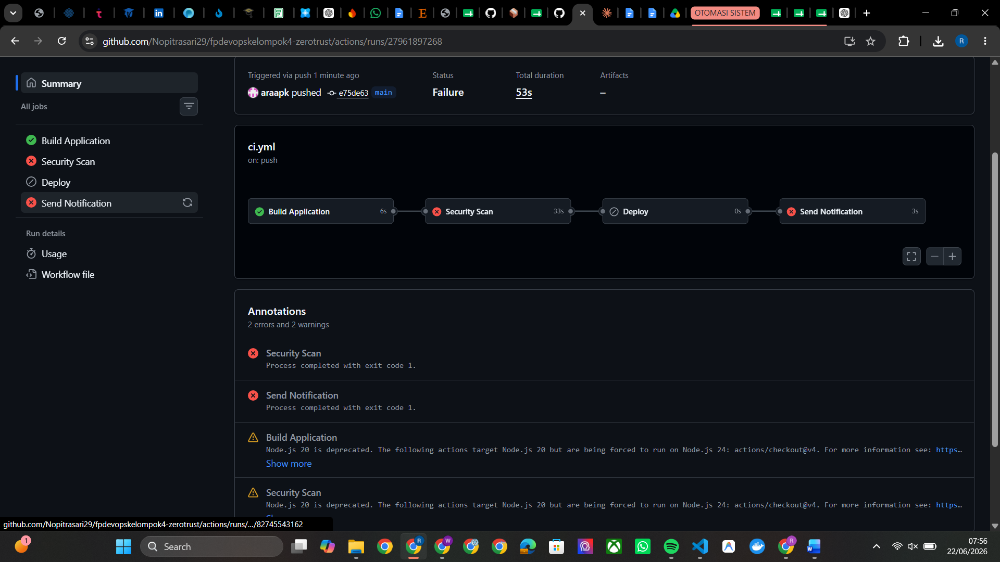
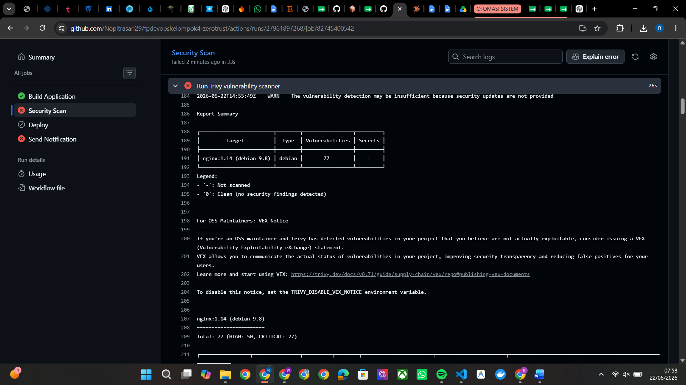
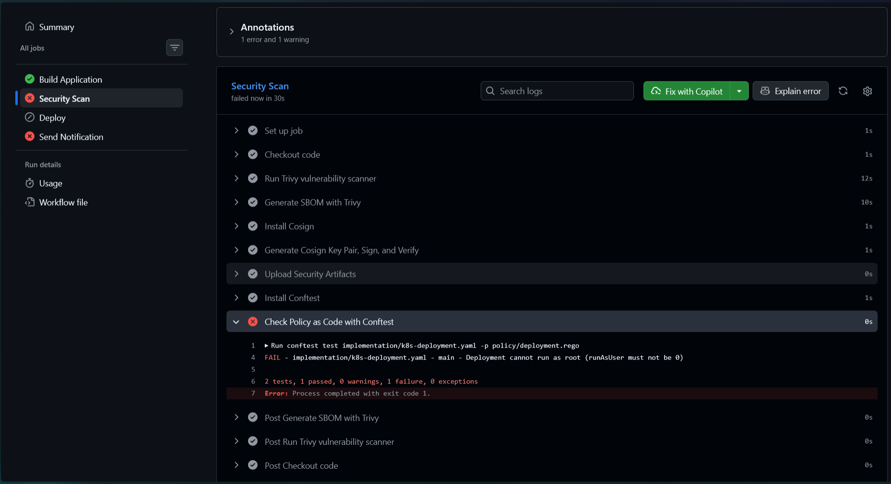
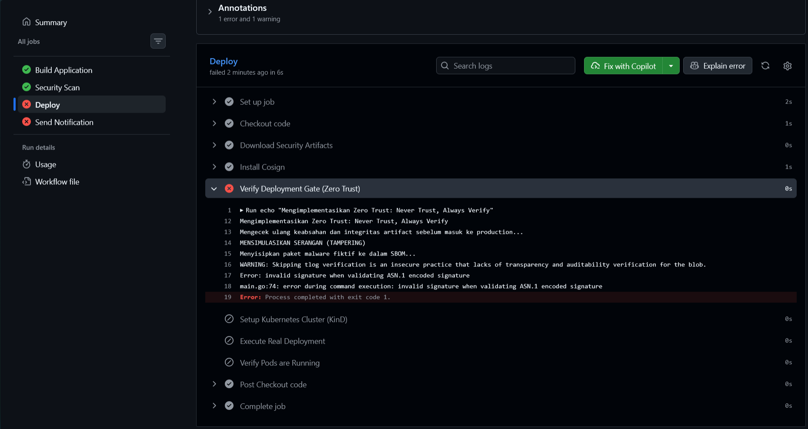
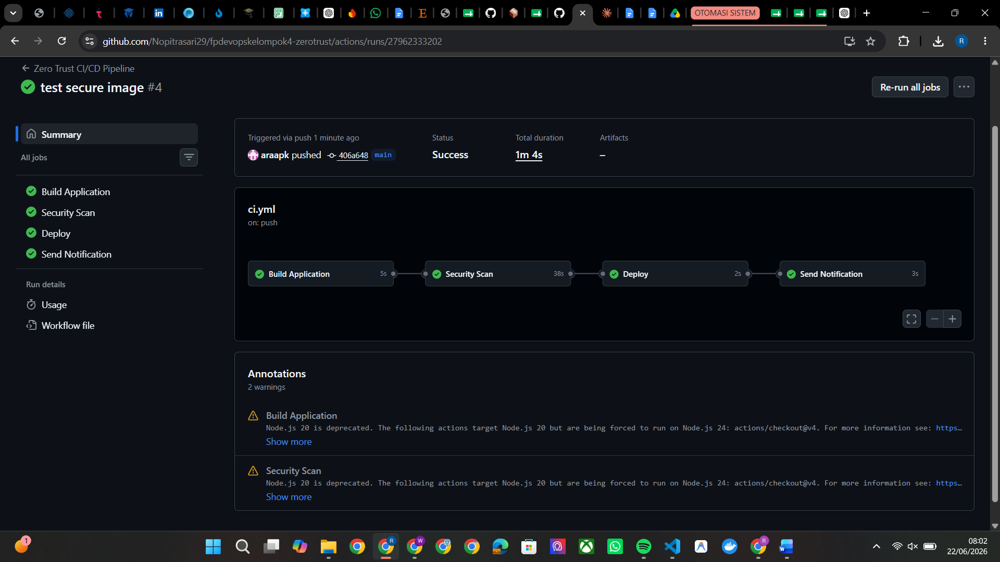

# Zero Trust CI/CD Security
### Automated Vulnerability Scanning + Conditional Deployment Gating

Mata Kuliah Operasional Pengembang (DevOps) — Final Project Week 16

Kelompok 4 — TaskFlow API

---

## 👥 Anggota Kelompok

| Nama | NRP | Jobdesk |
|--------|--------|--------|
| Hasan | 5027231073 | Jobdesk 1 — Setup & Implementasi Security Scan Job |
| Rafika Az Zahra Kusumastuti | 5027231050 | Jobdesk 2 — Implementasi Conditional Deployment Gate |
| Riskiyatul Nur Oktarani | 5027231013 | Jobdesk 3 — Skenario Before (Baseline Testing) |
| Aswalia Novitriasari | 5027231012 | Jobdesk 4 — Skenario After (Zero Trust Testing) & Overhead |
| Nisrina Atiqah Dwiputri Ridzki | 5027231075 | Jobdesk 5 — README & Reproducibility Validation |
| Farand Febriansyah | 5027231084 | Jobdesk 6 — Eksplorasi Tooling & State of the Art |
| M. Abhinaya Al Faruqi | 5027231011 | Jobdesk 7 — Evaluation Analysis, Refleksi & Demo |

---

## 📌 Topik

**Zero Trust CI/CD Security**
(Automated Vulnerability Scanning + Conditional Deployment Gating)

Project ini merupakan pengembangan dari pipeline CI/CD TaskFlow API pada modul-modul sebelumnya yang telah mengimplementasikan deployment otomatis menggunakan GitHub Actions.

Enhancement yang ditambahkan pada project ini:

- Automated Vulnerability Scanning menggunakan Trivy
- Conditional Deployment Gate
- Implementasi prinsip Zero Trust
- Verifikasi keamanan sebelum deployment

---

## 📖 Latar Belakang

Pipeline CI/CD sebelumnya masih menggunakan pendekatan *implicit trust*, yaitu artefak hasil build dapat langsung melanjutkan ke tahap deployment tanpa proses verifikasi keamanan tambahan.

Kondisi tersebut berisiko menyebabkan image yang memiliki vulnerability dapat masuk ke lingkungan produksi.

Untuk mengatasi masalah tersebut, project ini menerapkan prinsip:

> **Never Trust, Always Verify**

dengan menambahkan proses vulnerability scanning dan deployment gate sebelum deployment dijalankan.

---

## 🔄 Arsitektur Pipeline

### Pipeline Sebelumnya

```text
Build
↓
Deploy
```

### Pipeline Zero Trust

```text
Build
↓
Security Scan
↓
Deploy
↓
Notification
```

---

## ⚙️ Implementasi

### 1. Security Scan & SBOM Generation

Menggunakan:

- Trivy
- Severity Threshold:
  - HIGH
  - CRITICAL

Konfigurasi:

```yaml
severity: CRITICAL,HIGH
exit-code: 1
```

Apabila ditemukan vulnerability dengan severity HIGH atau CRITICAL maka pipeline otomatis gagal.
Selain itu, Trivy juga dikonfigurasi untuk mengekstrak **Software Bill of Materials (SBOM)** berformat CycloneDX yang akan digunakan untuk proses verifikasi.

---

### 2. Policy as Code (Conftest)
Sebelum *deployment*, file konfigurasi Kubernetes (`k8s-deployment.yaml`) diuji menggunakan **Conftest** dengan bahasa Rego (OPA). Terdapat aturan (*policy*) baku yang melarang *container* berjalan dengan akses *root* (`runAsUser: 0`). Jika melanggar, pipeline langsung digagalkan (Shift-Left Security).

---

### 3. Artifact Signing (Cosign)
File SBOM yang dihasilkan ditandatangani secara digital (*Blob Signing*) menggunakan **Cosign** (dari Sigstore). Kunci *public* dan *private* dibuat secara dinamis di dalam pipeline. Artifact dan *signature*-nya kemudian diunggah ke GitHub Artifacts untuk diverifikasi pada tahap deployment.

---

### 4. Conditional Deployment Gate

Berpegang teguh pada prinsip *"Never Trust, Always Verify"*, *Job* Deploy tidak serta-merta mempercayai hasil dari *Job* Security Scan. Gerbang *deployment* ini menerapkan **Verifikasi Kriptografis Zero Trust** secara bertahap:

1. **Job Dependency (`needs: security-scan`)**
   Deployment hanya diizinkan untuk *start* apabila *Job* Security Scan sebelumnya dinyatakan sukses.
2. **Unduh Artifact Mandiri**
   *Runner* Deploy mengunduh SBOM beserta kunci publik (`cosign.pub`) dan *signature* (`sbom.json.sig`) yang diteruskan dari tahapan sebelumnya.
3. **Verifikasi Kriptografis Independen**
   Mengeksekusi `cosign verify-blob` untuk memvalidasi ulang keaslian dokumen SBOM. Jika terdeteksi adanya *tampering* (perubahan isi dokumen oleh *hacker*), gerbang *deploy* tidak akan terbuka dan *pipeline* otomatis dihentikan.
4. **Setup Infrastruktur Ephemeral**
   Jika kriptografi valid, *runner* akan membangun infrastruktur Kubernetes secara instan menggunakan **KinD (Kubernetes in Docker)**.
5. **Real Deployment & Validasi Rollout**
   Aplikasi langsung dideploy secara sungguhan (`kubectl apply`) ke dalam *namespace* production, dilanjutkan dengan validasi `kubectl rollout status` (batas waktu 90 detik) untuk memastikan *Pod* NGINX benar-benar berjalan dengan sukses.

---

## 📂 Struktur Repository

```text
FPDEVOPSKELOMPOK4-ZEROTRUST/
│
├── .github/
│   └── workflows/
│       └── ci.yml
│
├── docs/
│   └── refleksi-kelompok.md
│
├── evaluation/
│   ├── screenshots/
│   │   ├── before-pipeline-failed.png
│   │   ├── before-trivy-report.png
│   │   └── after-pipeline-success.png
│   │
│   ├── analysis.md
│   ├── metrics-before.md
│   └── metrics-after.md
│
├── papers/
│   ├── paper-1-zerotrust-cicd.md
│   └── paper-2-zerotrust-financial.md
│
├── presentation/
│
├── research/
│   ├── 01-gap-analysis.md
│   ├── 02-state-of-the-art.md
│   └── 03-design-decisions.md
│
└── README.md
```

---

## 🚀 Menjalankan Pipeline

### 0. Prerequisites (Persiapan)
Sebelum menjalankan pipeline, pastikan hal berikut sudah tersedia:
- Akun GitHub dengan akses ke repository ini.
- Klaster Kubernetes (misalnya Minikube, GKE, atau EKS) yang sudah running.
- `kubectl` yang terkonfigurasi untuk terhubung ke klaster.
- GitHub Secrets yang sudah diatur di `Settings -> Secrets and variables -> Actions`:
  - `KUBECONFIG`: Berisi konten file konfigurasi kubeconfig Anda agar GitHub Actions dapat mendeploy ke klaster.
  - `REGISTRY_USERNAME` & `REGISTRY_PASSWORD`: Untuk autentikasi ke container registry (misalnya Docker Hub atau GHCR).

### 1. Clone Repository

```bash
git clone https://github.com/Nopitrasari29/fpdevopskelompok4-zerotrust.git
cd fpdevopskelompok4-zerotrust
```

### 2. Konfigurasi Deployment
Pastikan file manifest di folder `implementation/` sudah sesuai dengan image registry Anda.

### 3. Push Perubahan
Setelah melakukan perubahan, push ke main branch:

```bash
git add .
git commit -m "update configuration"
git push origin main
```

### 4. Buka GitHub Actions
Masuk ke tab **Actions** di repositori Anda untuk melihat proses:
1.  **Build**: Membangun container image.
2.  **Security Scan**: Menjalankan Trivy untuk pemindaian.
3.  **Deploy**: Melakukan deployment ke klaster (hanya jika security scan sukses).

---

## 🧪 Skenario Pengujian

### Before (Pipeline Konvensional)

Image:

```text
nginx:1.14
```

Hasil:

| Stage | Status |
|---------|---------|
| Build | Success |
| Security Scan | Failed |
| Deploy | Skipped |

Temuan Trivy:

| Severity | Jumlah |
|-----------|---------|
| Critical | 27 |
| High | 50 |
| Total | 77 |

Screenshot:

 
 

---

### Skenario Pengujian Zero Trust (Negative & Positive Test)

Untuk mendemonstrasikan pertahanan Zero Trust, dilakukan uji coba serangan (*Negative Testing*) dan pengujian kondisi normal (*Positive Testing*):

#### 1. Negative Test - Pelanggaran Policy as Code (Conftest)
- **Kondisi**: File YAML dikonfigurasi secara tidak aman untuk berjalan sebagai *root* (`runAsUser: 0`).
- **Hasil**: *Pipeline* **GAGAL** pada tahap pengecekan Conftest. Akses root diblokir sebelum mencapai infrastruktur Kubernetes.


#### 2. Negative Test - Supply Chain Tampering (Cosign)
- **Kondisi**: Menyimulasikan modifikasi file SBOM secara ilegal di proses transisi (menyisipkan paket *malware* fiktif ke dalamnya).
- **Hasil**: *Pipeline* **GAGAL** di *Job Deploy* pada *Deployment Gate*. Cosign mendeteksi *hash* dokumen SBOM tidak cocok dengan *signature* asli, menolak mendeploy dokumen yang dimodifikasi.


#### 3. After (Zero Trust Aktif & Positive Test)

Image:

```text
nginxinc/nginx-unprivileged:latest
```

Hasil:

| Stage | Status |
|---------|---------|
| Build | Success |
| Security Scan | Success |
| Deploy | Success |

Screenshot:

 

---

## 📊 Hasil Pengujian

Implementasi berhasil menunjukkan bahwa:

- Image rentan berhasil dideteksi oleh Trivy.
- Deployment dihentikan ketika ditemukan vulnerability HIGH atau CRITICAL.
- Miskonfigurasi infrastruktur terkait akses *root* berhasil dicegah oleh Conftest.
- Integritas hasil pemindaian dijamin oleh verifikasi kriptografis menggunakan Cosign; percobaan *tampering* berhasil digagalkan.
- Deployment hanya dapat dijalankan setelah lolos seluruh verifikasi keamanan (Zero Trust Validation) dan dieksekusi secara nyata menggunakan klaster Kubernetes (KinD).
- Prinsip Zero Trust berhasil diterapkan pada pipeline CI/CD.

---

## 📚 Referensi

1. Bhardwaj et al. (2025). Zero Trust CI/CD Pipeline: A Blueprint for Secure Software Delivery in Modern DevSecOps.
2. Shin et al. (2025). Enhancing Cloud-Native DevSecOps: A Zero Trust Approach for the Financial Sector.